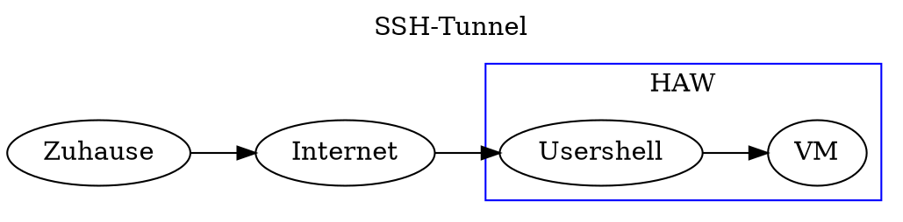
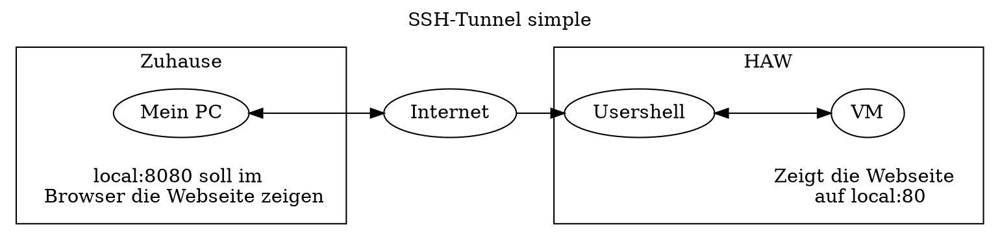
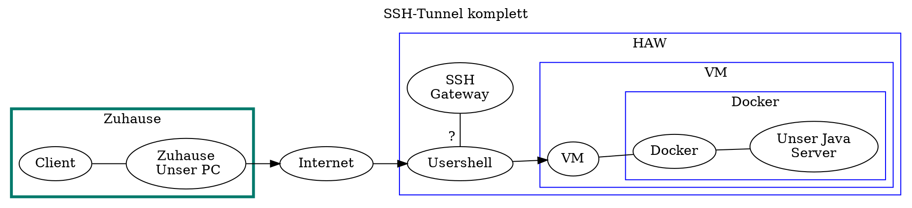
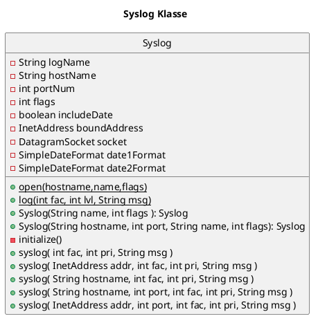

# Notizen zu RNP 2 - SSH - DOCKER - VM 

Wir sind Gruppe 20. 


## SSH 




### Login auf der VM 

Stand: man ist in der HAW-Usershell eingeloggt. 

Unsere Zieladresse/VM : 141.22.11.120 

=> Dort im Terminal: `ssh padawan@141.22.11.120`
-> Dann das Passwort `PassierscheinA38`

### Beschleunigung des Logins - ssh config 

In der Usershell 
- Schlüsselpaar erzeugen
  - `ssh-keygen`
    - Name: RechnerNetzePraktikum
    - kein Passphrase 
- Kopiere den Public-Key auf die VM
  - Man ist im .ssh Verzeichnis (oder dort wo sich die Schlüssel befinden)
  - Man benutzt scp :
    - `infwbm567@usershell:~/.ssh$ scp RechnerNetzePraktikum.pub padawan@141.22.11.120:/home/padawan/.ssh/`
- Den Inhalt der Datei an die Datei `authorized_keys` anhängen!
  - mit dem Operator `>>`
  -  `cat RechnerNetzePraktikum_FG.pub >> authorized_keys`
     -  Cat um sich den Inhalt aus der .pub-Datei zu holen 
**Jetzt** hat die VM quasi das Schloss 
In der Usershell: im Ordner `~/.ssh` in der Datei `config` folgendes eintragen 
```
Host rnp 
    User padawan 
    HostName 141.22.11.120 
    IdentityFile ~/.ssh/RechnerNetzePraktikum
```
Dadurch wird in der usershell folgendes Möglich : `ssh rnp` -> und zack ist man eingeloggt. kein passwort, keine meterlangen IPs/Hostnamen. 

rnp = Abkürzung, Bezeichnung kann man frei Wählen 

## SSH-Tunnel 

Quellen: 
- [linuxize](https://linuxize.com/post/how-to-setup-ssh-tunneling/) - Artikel 
- [YouTube](https://www.youtube.com/watch?v=N8f5zv9UUMI) - naja geht besser... 


Grundsätzliche Befehle : 

```bash 
ssh -L [LOCAL_IP:]LOCAL_PORT:DESTINATION:DESTINATION_PORT [USER@]SSH_SERVER
```

`ssh -L localerPort:zielmaschine:zielPort user@zwischenmaschine`

Konkret: 

```bash
ssh -L 8080:141.22.11.120:80 infwbm567@usershell.informatik.haw-hamburg.de
```

### Problem 

=> Eigentlich richtig. ABER:  
Ich werde, wie die Anleitung ja schreibt, dazu aufgefordert mich gegenüber dem SSH-Gateway 
mit IP/Host `141.22.40.11` zu authentifizieren. Das Schlägt knallhart fehl. 
Ich weiß nichts von einem Verification code. **Kacke**. 
Siehe: 
```bash 
ssh -L 8080:141.22.11.120:80 infwbm567@usershell.informatik.haw-hamburg.de
The authenticity of host 'usershell.informatik.haw-hamburg.de (141.22.40.11)' can't be established.
ED25519 key fingerprint is SHA256:F/YkDZk5XIet6//Qr7LZ6cZbLsZw9xb0ycAe6wQw/aU.
This key is not known by any other names
Are you sure you want to continue connecting (yes/no/[fingerprint])? y
Please type 'yes', 'no' or the fingerprint: yes
Warning: Permanently added 'usershell.informatik.haw-hamburg.de' (ED25519) to the list of known hosts.
#############################################################

**          **          ***    **                       **
***        ***        *** ***   ***         *         ***
***        ***       ***   ***   ***       ***       ***
********** ***      ***     ***   ***     ** **     ***
*** **********     ********* ***   ***    *   *    ***
***        ***    *** ***********   **** *     * ****
***        ***   ***           ***   ****       ****
***        ***  ***             ***   ***       ***
                                                     Hamburg
############################################################
(infwbm567@usershell.informatik.haw-hamburg.de) Password:
(infwbm567@usershell.informatik.haw-hamburg.de) Verification code:
```
Passwort und Username scheinen Zu Stimmen. Aber was zum henker ist der Verification code? 
Und/Oder wo kann ich einen Passenden Key ablegen um daran vorbei zu kommen?.... 


### Lösungsansatz 


```bash
ssh -L 8080:141.22.11.120:80 -i "C:\Users\fabia\Documents\4_Semester\10_Uebergreifend\SSH-HAW\HAW_ssh_2024-04-30.private"  infwbm567@usershell.informatik.haw-hamburg.de 
```
Gib dem SSH Login auf der Zwischenmaschine auch den Private Key mit ! 
=> Man ist dann auf der zwischenmaschine eingeloggt. 
=> der Port der VM wird durch die zwischenmaschine zur lokalen, eigenen maschine durchgereicht//Getunnelt. 


## SSH-Tunnel Simple Ausführung 


=> Der Tunnel würde durch die Usershell führen und den Eigenen PC mit der VM verbinden. 

### Komplizierter aufbau im Praktikum 



# Anpassungen am Code 

## Server 

### Syslog 





# DOCKER 

Auf dem VM docker laufen lassen : 

```bash 
padawan@svs01:~$ 

docker run -d -p 80:80 nginx
curl localhost:80

```

```bash 
# Das hier läuft leider nicht. Warum? 
# Erwartung: die Usershell fragt ab was die vm 
#            auf port 80 bereitstellt. 
# ABER da passiert nichts. 
infwbm567@usershell:~$ 
curl 141.11.20.120:80
```

## 
- https://www.youtube.com/watch?v=FzwIs2jMESM
- 

## Private Kommandos 

WSL zum RNP-Java Projekt
`cd /mnt/c/Users/fabia/Documents/4_Semester/40_Rechnernetze/30_Praktika_Uebung/RNP`

`sudo docker build -t server_fg:1.0 .` 
- Der punkt am ende ist wichtig
- Der image name muss klein sein 
- Das Dockerfile muss im Toplevel Ordner liegen 

## Image Verteilen, Kopieren, Weitergeben Transfer 

https://stackoverflow.com/questions/23935141/how-to-copy-docker-images-from-one-host-to-another-without-using-a-repository

```bash 
docker save -o <path for generated tar file> <image name>

scp /path/of/source user@DESTINATION-Server:/path/to/destination

docker save -o <path for generated tar file> <image name>
```

Konkret: 
```bash 
docker save -o ./ServerImageFG.tar server_fg:1.0

scp -i "C:\Users\fabia\Documents\4_Semester\10_Uebergreifend\SSH-HAW\HAW_ssh_2024-04-30.private" ServerImageFG.tar infwbm567@usershell.informatik.haw-hamburg.de:/home/ai-labor/infwbm567/Dokumente/RNP/ 

# Das hier läuft nicht. wahrscheinlich ist der port der VM gesperrt...
scp ServerImageFG.tar padawan@141.11.22.120:/home/padawan/

```